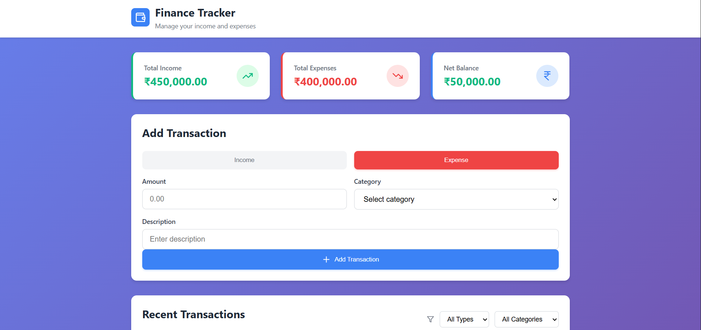
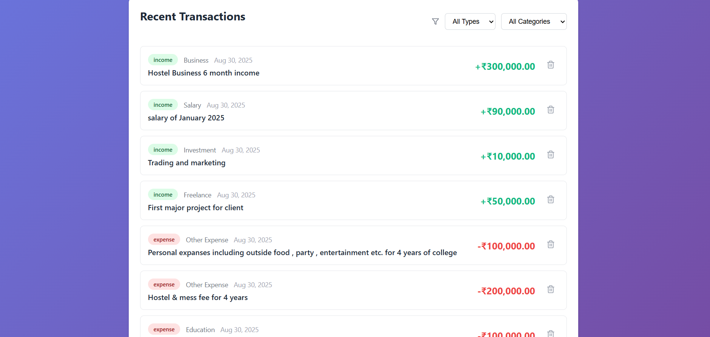

# Finance Tracker

A simple, modern web application to **manage your income and expenses**. Track your finances, see your net balance, and categorize transactions easily.

## Features

- Track income and expenses visually
- View summaries: Total Income, Total Expenses, and Net Balance
- Add, view, and delete transactions
- Filter recent transactions by type and category
- Responsive design: works on all devices

## Screenshots

## Technologies Used

- HTML, CSS (Fully responsive)
- JavaScript
- React with Vite
